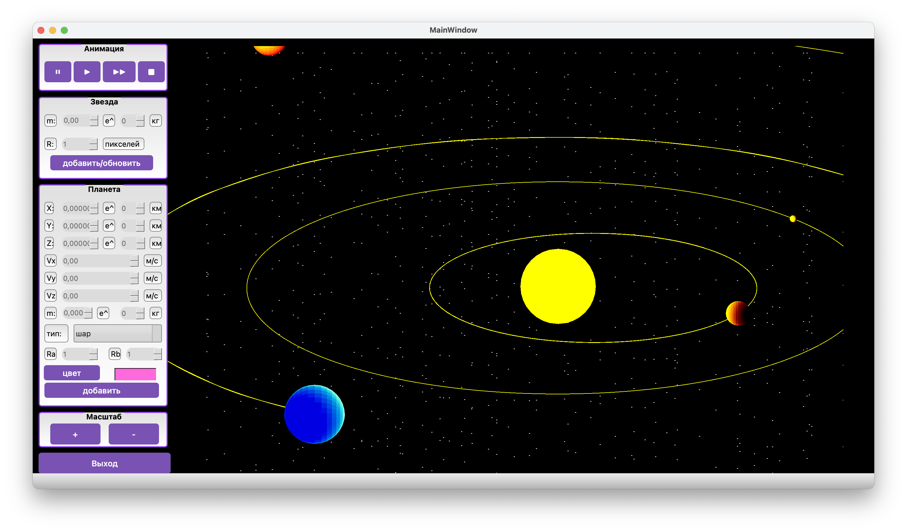
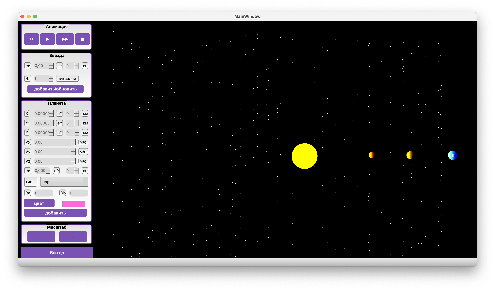
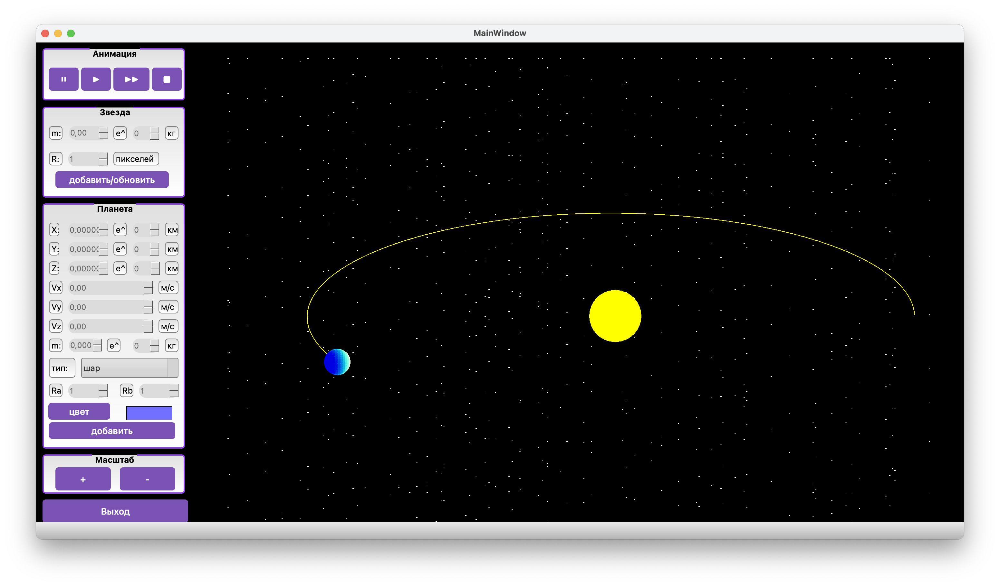

# CG_course_project
Курсовая работа по Компьютерной графике IU7
## Визуализация планетарной системы 
Движение планет по явной схеме Эйлера. Для использования нужно очень четко указывать начальные скорости планет, иначе они улетят в космос...
Только релизная сборка позволяет нормально посмотреть анимацию

